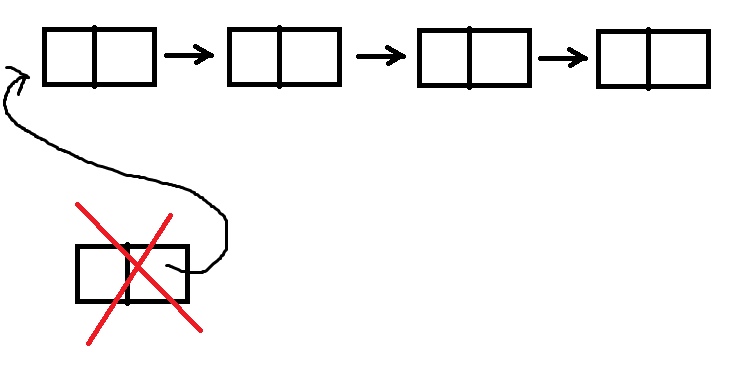
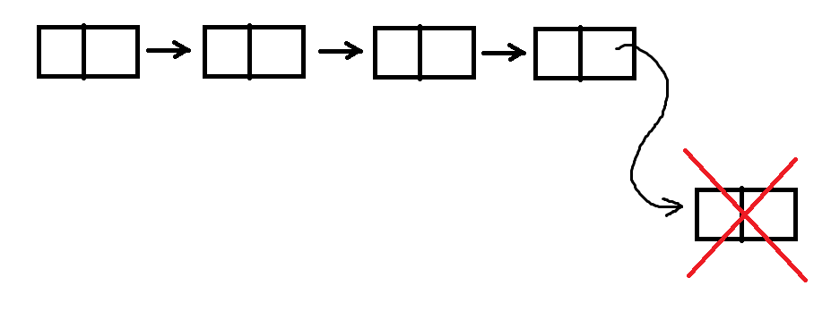

### 1. Why do we need linked lists?
    -   Not fixed amount of elements;
    -   Faster element adding and removing;

### 2. When to use arrays instead of linked lists?
    -   direct indexing is required;
    -   maximum number of elements is known in advance;
    -   better cache usage;

### 3. What are linked lists? Data structure which has the following structure:
    -   |value| --> |value| --> |value| --> ... --> |value|
    -   a sequence of nodes(boxes) where every node knows only about the one right next to it;

### 4. How are they implemented in C++?

```
struct Node
{
    int value;
    Node *next;
}
```
### 5. Can't we use another implementation instead of pointers?

```
struct Node
{
    int value;
    Node next;
}
```
This is simply impossible because that type is incomplete!

So maybe we can try:
```
struct Node2;
struct Node1

{
    int value;
    Node2 next;
};

struct Node3;
struct Node2
{
    int value;
    Node3 next;
};

struct Node4;
struct Node3
{
    int value;
    Node4 next;
};

struct Node5;
struct Node4
{
    int value;
    Node5 next;
};
...
```
But how far can we go? The idea was not to store fixed amount of elements, which is impossible that way!

### 6. But why should we use dynamic memory?!
- Assume we have the following code, which adds an element at the beginning of a linked list and returns the new head:

```
Node* AddFront(Node *head, int valueToAdd)
{
    Node newHead;
    newHead.value = valueToAdd;
    newHead.next = head;
    
    return &newHead;
}
```
What happens here after the end of the function scope?

Boom... our new head is destroyed because it is located on the stack. :( Solution:

```
Node* AddFront(Node *head, int valueToAdd)
{
    Node *newHead = new Node;
    newHead->value = valueToAdd;
    newHead->next = head;
    
    return newHead;
}
```

- Assume we have the following code, which adds an element at the end of a linked list and returns the head:

```
Node* AddEnd(Node *head, int valueToEnd)
{
    Node newNode;
    newNode.value = valueToEnd;
    newNode.next = nullptr;
    
    if(head == nullptr)
    {
        return &newNode;
    }

   Node *crr = head;
   while(crr->next != nullptr)
   {
       crr = crr->next;
   }
   crr->next = &newNode;
   
   return head;
}
```
What happens here after the end of the function scope?

Boom... our new head is destroyed because it is located on the stack. :( Solution:
```
Node* AddEnd(Node *head, int valueToEnd)
{
    Node *newNode = new Node;
    newNode->value = valueToEnd;
    newNode->next = nullptr;
    
    if(head == nullptr)
    {
        return newNode;
    }

   Node *crr = head;
   while(crr->next != nullptr)
   {
       crr = crr->next;
   }
   crr->next = newNode;
   
   return head;
}
```